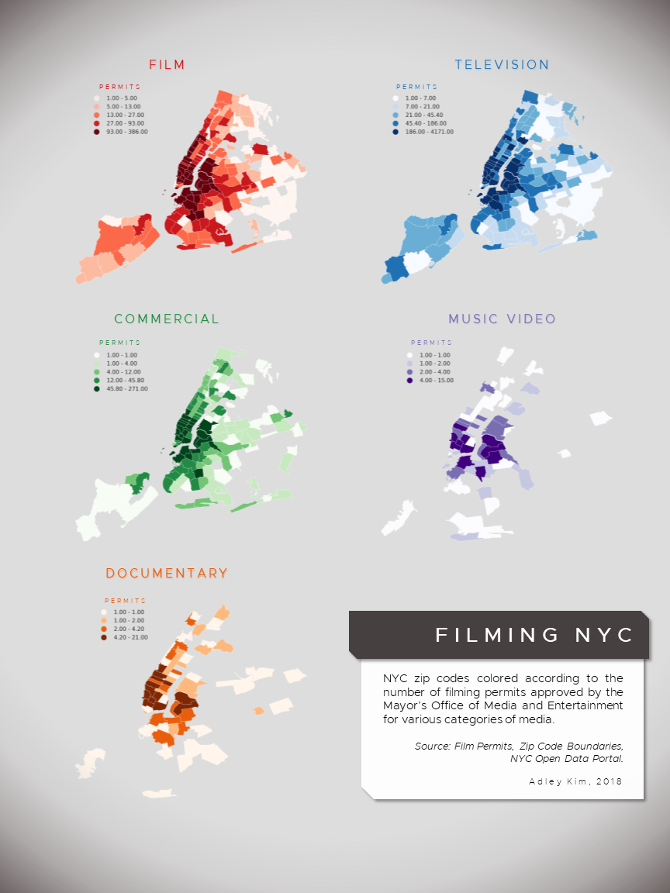

# Review of Adley Kim's plot of filming permits in NYC:

Adley's plot of filming permits in NYC provides an informative comparison of the different kinds of filming permits across NYC zip codes. The plots accurately reflect the data, however, they could be improved if all zip codes were included in each plot. For example, in the plots for music video and documentary film permits, some zip codes are missing, which appears to be caused by the lower limit of the plot (values greater than or equal to 1). If the lower limit of the plot were set at 0, all zip codes should appear. The visualization also might benefit from a sort of combined plot that displays film permits by type upon one basemap.

Kim's plot:

